# ToDo-App-Fullstack-NextJS

Welcome to the **ToDo-App-Fullstack-NextJS**, a full-stack, lightweight, and simple to-do application built using **Next.js** with both backend and frontend integrated seamlessly.

This project shows the power of **Next.js** and serves as a practical demonstration of using Next.js as a complete full-stack framework, incorporating authentication, dark mode, and local storage for data persistence.

## Table of Contents

- [🌟 **Features**](#-features)
- [🚀 **Live Deployment**](#-live-deployment)
- [🖼️ **UI Preview**](#-ui-preview)
- [📂 **File Structure**](#-file-structure)
- [📋 **API Endpoints**](#-api-endpoints)
  - [**1. Prerequisites**](#1-prerequisites)
  - [**2. Clone the Repository**](#2-clone-the-repository)
  - [**3. Install Dependencies**](#3-install-dependencies)
  - [**4. Set Up Environment Variables**](#4-set-up-environment-variables)
  - [**5. Run the Development Server**](#5-run-the-development-server)
  - [**6. Build for Production**](#6-build-for-production)
- [🌐 **Using the App**](#-using-the-app)
- [📝 **Swagger API Documentation**](#-swagger-api-documentation)
- [📝 **OpenAPI Specification**](#-openapi-specification)
  - [Using the `openapi.yaml` File](#using-the-openapiyaml-file)
- [💡 **Notes**](#-notes)
- [🧪 **Testing**](#-testing)
  - [**Running Tests**](#running-tests)
- [🐳 **Containerization**](#-containerization)
- [🔧 **Contributing**](#-contributing)
- [📝 **License**](#-license)
- [📧 **Contact**](#-contact)

## 🌟 **Features**

- Full-stack application with Next.js for both frontend and backend
- Full authentication system (Register and Login)
- Dark and Light mode
- User-specific to-do lists with different categories
- CRUD operations for to-do items
- MongoDB database for data storage
- WebSockets for real-time updates to To-Do items
- Responsive design
- Add, edit, delete, and complete tasks
- Persistent storage using SQLite and in-memory storage
- A clean, modern, and responsive UI
- PWA support with offline capabilities
- Basic testing for API endpoints and utility functions
- Easy-to-understand file structure and codebase
- Customizable with additional features and improvements

## 🚀 **Live Deployment**

The application is deployed live on **Vercel**. You can access it at [https://todo-app-nextjs-stack.vercel.app/](https://todo-app-nextjs-stack.vercel.app/landing).

The app features a landing page, authentication (login, register, and forgot password), a to-do list, and a Swagger API documentation page, as well as real-time to-do updates using WebSockets.

## 🖼️ **UI Preview**

### **Landing Page**

#### **Light Mode**

<p align="center">
  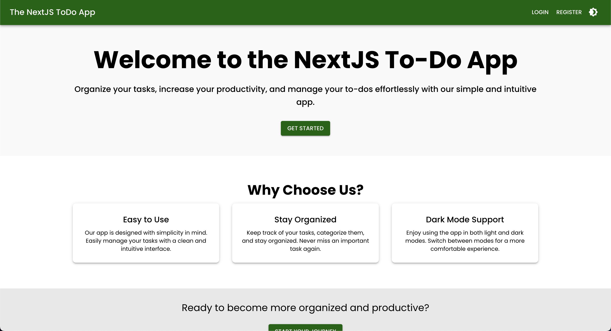
</p>

#### **Dark Mode**

<p align="center">
  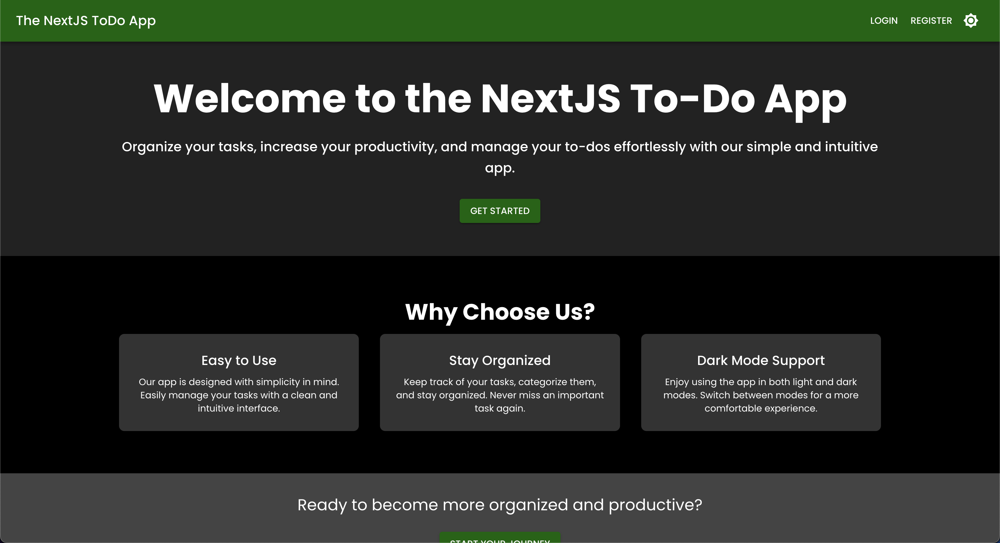
</p>

### **Login Page**

#### **Light Mode**

<p align="center">
  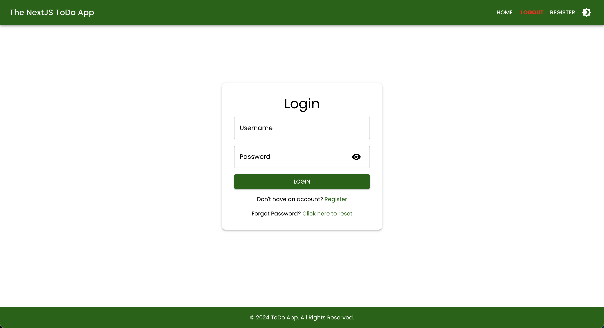
</p>

#### **Dark Mode**

<p align="center">
  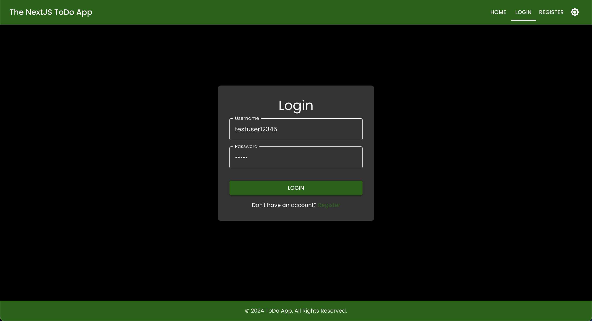
</p>

### **Register Page**

#### **Light Mode**

<p align="center">
  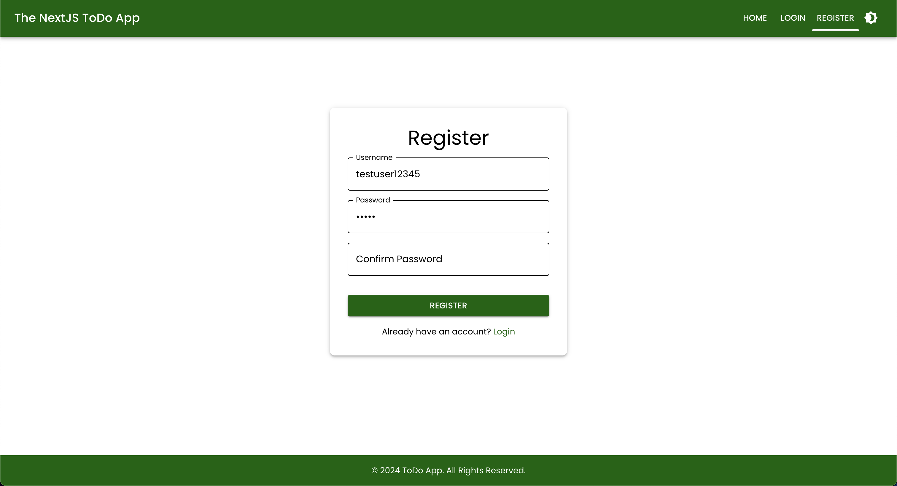
</p>

#### **Dark Mode**

<p align="center">
  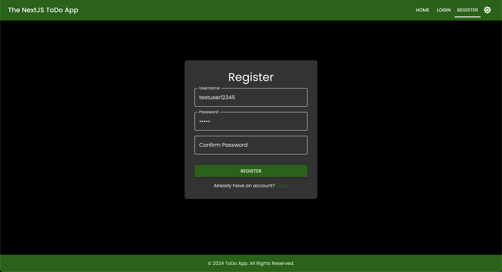
</p>

### **Homepage (To-Do List)**

#### **Light Mode**

<p align="center">
  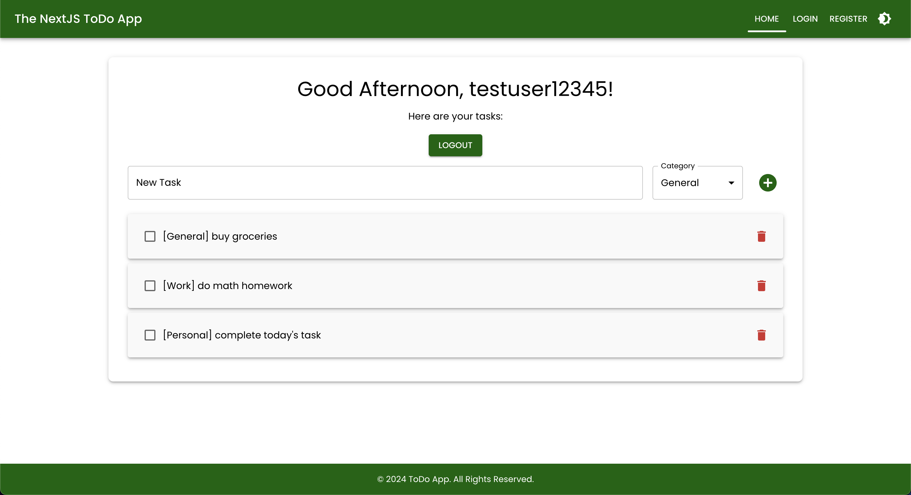
</p>

#### **Dark Mode**

<p align="center">
  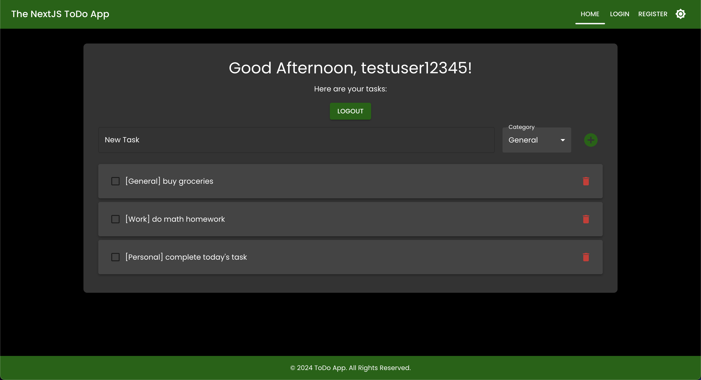
</p>

### **Forgot Password Page**

#### **Light Mode**

<p align="center">
  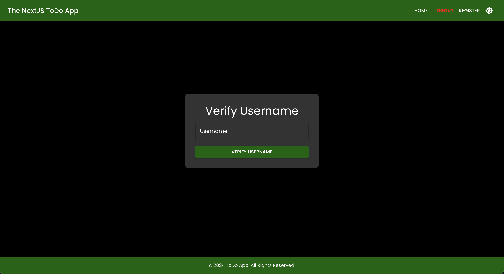
</p>

#### **Dark Mode**

<p align="center">
  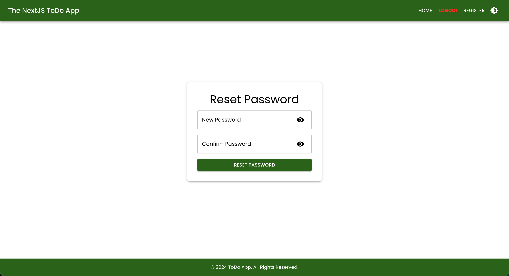
</p>

## 📂 **File Structure**

Below is the comprehensive file structure for the project:

```
todo-app-fullstack-nextjs/
│
├── public/
│   ├── sitemap.xml
│   ├── robots.txt
│   ├── manifest.json
│   ├── favicon.ico
│   └── images/
│
├── src/
│   ├── app/
│   │   ├── api/                     # Backend API endpoints
│   │   │   ├── swagger.ts           # Swagger API documentation
│   │   │   ├── auth/
│   │   │   │   ├── login/
│   │   │   │   │   └── route.ts     # Login route
│   │   │   │   ├── register/
│   │   │   │   │   └── route.ts     # Registration route
│   │   │   │   ├── reset-password/
│   │   │   │   │   └── route.ts     # Reset password route
│   │   │   │   └── verify-email/
│   │   │   │       └── route.ts     # Email verification route
│   │   │   └── todos/
│   │   │       └── route.ts         # Full CRUD operations for todos
│   │   │
│   │   ├── auth/                    # Authentication pages
│   │   │   ├── reset-password/
│   │   │   │   └── page.tsx         # Reset password page
│   │   │   ├── login/
│   │   │   │   └── page.tsx         # Login page
│   │   │   └── register/
│   │   │       └── page.tsx         # Registration page
│   │   │
│   │   ├── landing/
│   │   │   └── page.tsx             # Landing page
│   │   │
│   │   ├── swagger/
│   │   │   └── page.tsx             # Swagger API documentation page
│   │   │
│   │   ├── layout.tsx               # Layout for the entire app
│   │   ├── page.tsx                 # Homepage with conditional redirect logic
│   │   ├── page.css                 # Homepage styles
│   │   ├── page.module.css          # Homepage module styles
│   │   └── globals.css              # Global CSS styles
│   │
│   ├── fonts/                       # Custom fonts
│   │
│   └── types/                       # TypeScript types
│       └── swagger-ui-react.d.ts    # Swagger UI types
│
├── nginx/                           # Nginx configuration
│   ├── default.conf                 # Default Nginx configuration
│   └── nginx.conf                   # Nginx configuration
│
├── kubernetes/                      # Kubernetes configuration
│   ├── frontend-deployment.yaml     # Frontend deployment configuration
│   ├── frontend-service.yaml        # Frontend service configuration
│   ├── backend-deployment.yaml      # Backend deployment configuration
│   ├── backend-service.yaml         # Backend service configuration
│   └── configmap.yaml               # ConfigMap for environment variables
│
├── .env.local                       # Environment variables (if using)
├── next.config.js                   # Next.js configuration
├── Dockerfile                       # Docker configuration
├── next.config.js                   # Next.js configuration
├── package-lock.json                # Locked versions of dependencies
├── package.json                     # Project dependencies and scripts
├── tsconfig.json                    # TypeScript configuration
├── Jenkinsfile                      # Jenkins CI/CD pipeline
├── .gitignore                       # Files and directories to ignore
├── .eslintrc.json                   # ESLint configuration
├── manage_app.sh                    # Script to manage the app
├── openapi.yaml                     # OpenAPI Specification
├── LICENSE                          # Project license
└── README.md                        # This README file
```

## 📋 **API Endpoints**

Here's a table listing all the API endpoints provided by this application:

| HTTP Method | Endpoint                   | Description                       |
|-------------|----------------------------|-----------------------------------|
| `POST`      | `/api/auth/login`          | Log in with username and password |
| `POST`      | `/api/auth/register`       | Register a new user               |
| `GET`       | `/api/todos`               | Fetch all todos for a user        |
| `POST`      | `/api/todos`               | Create a new to-do item           |
| `PUT`       | `/api/todos`               | Update a to-do item               |
| `DELETE`    | `/api/todos`               | Delete a to-do item               |
| `PATCH`     | `/api/todos`               | Mark a to-do item as completed    |
| `POST`      | `/api/auth/reset-password` | Reset user password               |
| `POST`      | `/api/auth/verify-email`   | Verify user email                 |

## 🛠️ **Getting Started**

Follow this step-by-step guide to set up the project locally.

### **1. Prerequisites**

Ensure you have the following installed:

- [Node.js](https://nodejs.org/en/download/) (v14 or later)
- [npm](https://www.npmjs.com/) or [Yarn](https://yarnpkg.com/)

### **2. Clone the Repository**

```bash
git clone https://github.com/hoangsonww/ToDo-App-NextJS-Fullstack.git
cd ToDo-App-NextJS-Fullstack
```

### **3. Install Dependencies**

If you're using npm:

```bash
npm install
```

Or, if you're using Yarn:

```bash
yarn install
```

### **4. Set Up Environment Variables**

Create a `.env.local` file in the root directory if any environment variables are required. (Currently, the project doesn't use any external services that require environment variables).

### **5. Run the Development Server**

Start the development server:

```bash
npm run dev
```

Or, if using Yarn:

```bash
yarn dev
```

The application should now be running at `http://localhost:3000`.

### **6. Build for Production**

To build the project for production, run:

```bash
npm run build
```

Or, if using Yarn:

```bash
yarn build
```

To start the production server:

```bash
npm run start
```

Or:

```bash
yarn start
```

The production build will be served at `http://localhost:3000`.

## 🌐 **Using the App**

1. **Visit the Landing Page** (`/landing`): Introduces the app with the option to log in or register.
2. **Authentication**:

- Register: Create a new account via the `/auth/register` page.
- Login: Access your account through the `/auth/login` page.

3. **Manage To-Dos**: Access the main to-do list page (`/`) where you can add, edit, and delete to-dos, as well as toggle dark mode.

Alternatively, you can directly access the deployed application at [https://todo-app-nextjs-stack.vercel.app/](https://todo-app-nextjs-stack.vercel.app/).

## 📝 **Swagger API Documentation**

The application includes a Swagger API documentation page that lists all the available API endpoints and their descriptions. You can access the Swagger documentation at `/swagger`.

Here is what it looks like:

<p align="center">
  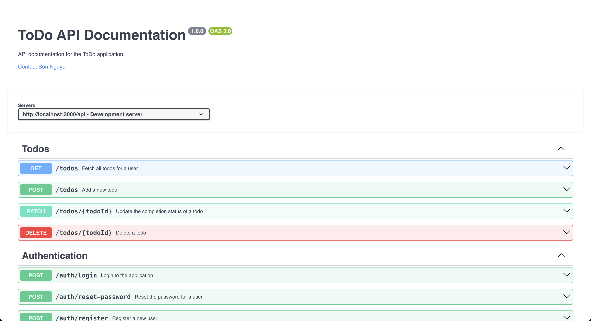
</p>

## 📝 **OpenAPI Specification**

### Using the `openapi.yaml` File

1. **View the API Documentation**

- Open [Swagger Editor](https://editor.swagger.io/).
- Upload the `openapi.yaml` file or paste its content.
- Visualize and interact with the API documentation.

2. **Test the API**

- Import `openapi.yaml` into [Postman](https://www.postman.com/):
  - Open Postman → Import → Select `openapi.yaml`.
  - Test the API endpoints directly from Postman.
- Or use [Swagger UI](https://swagger.io/tools/swagger-ui/):
  - Provide the file URL or upload it to view and test endpoints.

3. **Generate Client Libraries**

- Install OpenAPI Generator:
  ```bash
  npm install @openapitools/openapi-generator-cli -g
  ```
- Generate a client library:
  ```bash
  openapi-generator-cli generate -i openapi.yaml -g <language> -o ./client
  ```
- Replace `<language>` with the desired programming language.

4. **Generate Server Stubs**

- Generate a server stub:
  ```bash
  openapi-generator-cli generate -i openapi.yaml -g <framework> -o ./server
  ```
- Replace `<framework>` with the desired framework.

5. **Run a Mock Server**

- Install Prism:
  ```bash
  npm install -g @stoplight/prism-cli
  ```
- Start the mock server:
  ```bash
  prism mock openapi.yaml
  ```

6. **Validate the OpenAPI File**

- Use [Swagger Validator](https://validator.swagger.io/):
  - Upload `openapi.yaml` or paste its content to check for errors.

This guide enables you to view, test, and utilize the API. You can also generate client libraries, server stubs, and run a mock server using the OpenAPI Specification.

## 💡 **Notes**

- This application uses local storage to manage user data and to-do items. For a more robust application, consider integrating a real database (e.g., MongoDB, PostgreSQL).
- The dark mode toggle is handled with React state and applied to various components via Material-UI's `ThemeProvider`.

## 🧪 **Testing**

### **Running Tests**

This project includes a few basic tests for the API endpoints and utility functions. To run the tests, use the following command:

```bash
npm run test
```

Or, if using Yarn:

```bash
yarn test
```

The tests will run and display the results in the terminal.

## 🐳 **Containerization**

This project includes a `Dockerfile` for containerization. To build the Docker image, run:

```bash
docker compose up --build
```

This command will build the Docker image and start the container. The application will be accessible at `http://localhost:3000`.

## 🔧 **Contributing**

Contributions are welcome! If you'd like to contribute, please fork the repository, make your changes, and create a pull request.

## 📝 **License**

This project is licensed under the MIT License. See the [LICENSE](LICENSE) file for more information.

## 📧 **Contact**

For any inquiries or feedback, feel free to reach out to the author at `hoangson091104@gmail.com`.

Enjoy using the **ToDo-App-Fullstack-NextJS**! 🎉

---

Happy coding! 🚀

[Back to Top ↑](#todo-app-fullstack-nextjs)
